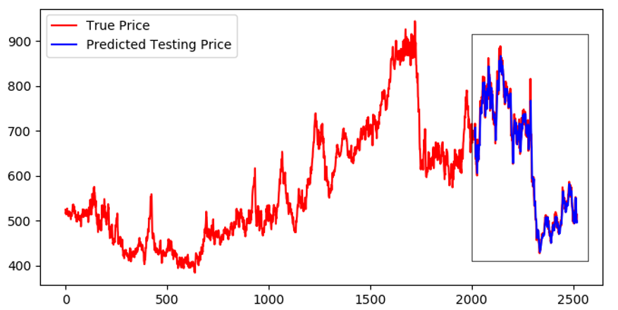

# Commodity Price Forecasting
The entire code (LSTM.py) is written with the help of guidelines available in Keras documentation (https://keras.io) and is well organized into six Sections. The first Section loads the necessary libraries and dependencies required. The second Section contains the preprocessing steps like train/test split and normalization. A custom function create_datasetlstm was created which returns a data structure that can be reshaped into a 3D tensor vector which is the required input to the LSTM network model. The third Section builds and compiles the network. The fourth Section trains the network and plots the training and validation loss per epoch of the network. In the fifth Section predictions are made for one day into the future. Two plots are generated the first plot shows all the actual values of the times series along with the predicted values and the second plot only displays the actual values corresponding to the predicted values. In the sixth contains two functions predict_multiple and plot_multiple where predictions of prices can be made and plotted for longer periods.

## Source of the Data
Link: https://ca.investing.com/commodities/us-wheat-historical-data  
The downloaded data is provided under the name 'WUS.csv'

## Tools and Software Version
* The entire project was created and developed in Windows 10 operating system with an
 i7-7700HQ intel processor using a NVIDIA GeForce GTX 1070 GPU.  
* Programming Language : Python (3.6.7)  
* Python IDE : Spyder (3.3.2)  
* Additional libraries and their versions are given in the table below.

| Libraries| Versions |
| :-------------  | :------------- |
|TensorFlow-gpu  | 1.12.0        |
| Keras-gpu      |2.2.4          |
|Scikit-learn  | 0.20.1       |
| Numpy      |1.15.4         |
|Pandas  | 0.24.0       |
| Matplotlib     |3.0.2          |  

## Network Training

* MSE and MAE of the Network using different optimizers

|Optimizer|	MSE	| MAE|
| :----  | :---- | :---- |
|SGD	|0.0042|	0.0469|
|Adam	|9.23E-04|	0.0224|
|RmsProp	|0.0013	|0.0259|
|AdaDelta	|0.0018|	0.0318|

* Training and validation loss plots
    

## 	EXPERIMENTAL RESULTS
The Model which trained using the Adam optimizer was selected to generate 1-day ahead and 50-days ahead forecasts using the test dataset.

* One-day Ahead Forecast 
    
  

* 50-day Ahead Forecast 

